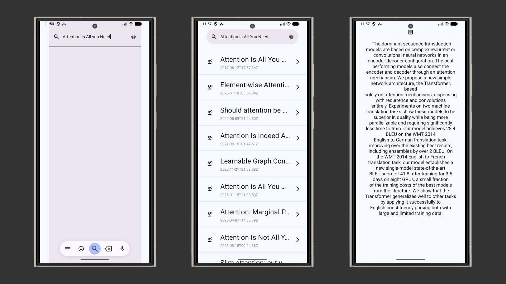

# Yellow Needle

---

**Mobile App for Discovering AI & ML Research Papers Ahead of the Curve**



---
## 
Get concise summaries of the latest research while commuting or casually browsing, so you can quickly identify relevant insights without wading through long, irrelevant papers.
---

##  Features


- Filter papers in **Robotics, Computer Vision, NLP, and Machine Learning**
- Discover implementation-ready ideas before they trend
- Quickly assess relevance through summarized content

---

##  Technologies

- Kotlin Multiplatform (KMP)
- Jetpack Compose + Compose Multiplatform
- Ktor 
- MVVM 
- Dependency Injection with Dagger

---

## 🧭 Getting Started

### 1. Clone the repository
```bash
git clone https://github.com/KoneMuhammad/yellowneedle.git
```

Make sure **composeApp** is selected before clicking Run ▶️

